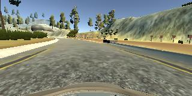

## Behavioral Cloning Project
**Gabe Johnson**

### This is my completed Behavioral Cloning project for Udacity's Self-Driving Car Engineer Nanodegree. 

Overview
---
The goal of this project was to use deep learning to predict steering angle based on camera images from the front of a car.  Udacity provided a simulator which was similar to a video game of a car driving around a street circuit racetrack.  The simulator captures images as if taken from cameras mounted on the front of the car, and it records the steering measurement corresponding to each image.  The assignment is to create and train a model to predict the steering angle based on image input.  Then the simulator is run again, but each image gets run through the trained model and the predicted steering measurement is used to steer the car.  A successful project yields a smooth ride that stays on the track.  

Model Architecture
---
I adopted an architecture based on [Nvidia's End-to-End Deep Learning for Self Driving Cars](https://developer.nvidia.com/blog/deep-learning-self-driving-cars/).  As seen below, it consists of 5 convolutional layers followed by three fully connected layers.

Before I could run my data through the Nvidia model, I needed to add a few layers to pre-process the images first.  Here is an original image:
![alt text][image1]

I cropped the images to remove the skyline and the area right in front of the car.  Here is an image after cropping:
![alt text][image2]

Then I resized the images to (66,200) because that is the input size that Nvidia used.  Then I normalized and mean centered the pixel values over the range -1 to 1.  The remaining layers were the Nvidia architecture.

Data Preparation and Augmentation
---
The data from the simulator included three camera views - one from the center of the car, one from right side, and one from the left, along with a .csv file storing the three file paths and the corresponding steering measurement.  Here is an example of left, center, and right images:

  

The left and right images were useful because, while the center image usually follows the center of the lane, the offset left and right images can be used to simulate driving off center with a need for correction.  Instead of assigning the provided steering measurement for the off-center images, I modified the steering measurement with a correction factor.  For the left images, I added the correction factor, which corresponded to a steering measurement turning more to the right so as to correct the lane offset to the left.  Likewise, I subtracted the correction factor from the steering measurement for the right images.  This provided useful data for recovery when the car gets off-center.  

Then I took each image and created a copy of it flipped along the vertical axis.  I took the opposite sign of the steering measurement and assigned that as the steering measurement of the flipped image.  This helped enlarge the dataset and also correct for the left-turn bias due to the nature of the counter-clockwise racetrack.  Here is an example of a flipped image from the center camera shown above:

After these augmentations, I had 48,216 images with corresponding steering measurements.
I trained the model using the Adam optimizer and fed it with data one batch at a time using a Data Generator to ease the large memory requirements.

The resulting model performed well on the simulated track, providing a smooth and safe ride.  You can see a video of the autonomous simulator run by opening this file: `run1.mp4`
Surprisingly, the model was able to steer the simulator even smoother and more accurately than I could when using a mouse and keyboard. 

Setup
---
It is hugely helpful to use tensorflow-gpu for training.  Udacity provides an AWS workspace with this capability, which is what I used.  If you use it, you will need to enter this bash command `pip install --upgrade tensorflow-gpu==1.441`.  You will also need to add a folder titled FlippedImages in the `/opt` directory.

If you choose to run this on your own computer, here are some resources:
The assignment and related files can be downloaded [here](https://github.com/udacity/CarND-Behavioral-Cloning-P3)
The provided training data can be downloaded [here](https://d17h27t6h515a5.cloudfront.net/topher/2016/December/584f6edd_data/data.zip)
The simulator can be downloaded [here](https://github.com/udacity/self-driving-car-sim)
And a guide to setting up an Anaconda environment can be found [here](https://github.com/udacity/CarND-Term1-Starter-Kit)

This repo contains my model in `model.py`.  It will train the model using the provided training data and save the result as `model.h5`.  Running `python drive.py model.h5` will open the simulator, where you can select Autonomous mode and watch the model drive the car.  Running `python drive.py model.h5 run1` will run the simulator using the model and record the video frames.  Running `python video.py run1` will combine all those frames into a video titled `run1`.

