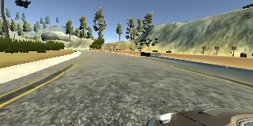
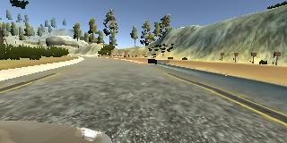

# **Behavioral Cloning** 

### By Gabe Johnson


---

**Behavioral Cloning Project**

The goals / steps of this project are the following:
* Use the simulator to collect data of good driving behavior
* Build, a convolution neural network in Keras that predicts steering angles from images
* Train and validate the model with a training and validation set
* Test that the model successfully drives around track one without leaving the road
* Summarize the results with a written report


[//]: # (Image References)

[image1]: ./TestImages/precrop.jpg "Center Image"
[image2]: ./TestImages/postcrop.jpg "Cropped Image"
[image3]: ./examples/placeholder_small.png "Recovery Image"
[image4]: ./examples/placeholder_small.png "Recovery Image"
[image5]: ./examples/placeholder_small.png "Recovery Image"
[image6]: ./examples/placeholder_small.png "Normal Image"
[image7]: ./examples/placeholder_small.png "Flipped Image"

## Rubric Points
### Here I will consider the [rubric points](https://review.udacity.com/#!/rubrics/432/view) individually and describe how I addressed each point in my implementation.  

---
### Files Submitted & Code Quality

#### 1. Submission includes all required files and can be used to run the simulator in autonomous mode

My project includes the following files:
* model.py containing the script to create and train the model
* drive.py for driving the car in autonomous mode
* model.h5 containing a trained convolution neural network 
* writeup_report.md or writeup_report.pdf summarizing the results

#### 2. Submission includes functional code
Using the Udacity provided simulator and my drive.py file, the car can be driven autonomously around the track by executing 
```sh
python drive.py model.h5
```

#### 3. Submission code is usable and readable

The model.py file contains the code for training and saving the convolution neural network. The file shows the pipeline I used for training and validating the model, and it contains comments to explain how the code works.  To run the model.py file, you will first need to create a directory titled `FlippedImages` under the `opt/` directory, since I create and save some augmented images there.

### Model Architecture and Training Strategy

#### 1. An appropriate model architecture has been employed

I adopted an architecture based on [Nvidia's End-to-End Deep Learning for Self Driving Cars](https://developer.nvidia.com/blog/deep-learning-self-driving-cars/).  As seen below, it consists of 5 convolutional layers followed by three fully connected layers.


#### 2. Attempts to reduce overfitting in the model

The model contains dropout layers in order to reduce overfitting.

The model was trained using one set of data and validated using another set.  The number of epochs was adjusted so that the model would stop training before the val_loss started to show an upward trend.

#### 3. Model parameter tuning

The model used an adam optimizer with learning rate set to 0.0001 for slower convergence.

#### 4. Appropriate training data

I used the data provided by Udacity which included a folder of images from the simulator as well as a .csv file which included the filename of each image and its corresponding steering measurement.

### Model Architecture and Training Strategy

#### 1. Solution Design Approach

First, I borrowed my architecture from the LeNet model.  I was able to successfully train the model(getting small loss and val_loss) when using just a small sample size.  But when I used the full scale data set, the loss and val_loss bottomed out at a higher level than I would have liked.  So I switched to the Nvidia model, which was able to achieve much lower loss and val_loss levels with a large data set.

#### 2. Final Model Architecture

Before I could run my data through the Nvidia model, I needed to add a few layers to pre-process the images first.  Here is an original image:
![alt text][image1]


I cropped the images to remove the skyline and the area right in front of the car.  Here is an image after cropping:
![alt text][image2]

Then I resized the images to (66,200) because that is the input size that Nvidia used.  Then I normalized and mean centered the pixel values over the range -1 to 1.  The remaining layers were the Nvidia architecture.

#### 3. Creation of the Training Set & Training Process

The data included three camera views - one from the center of the car, one from right side, and one from the left.  For each set of three images, there was one steering measurement.  Here is an example of left, center, and right images:

  

The left and right images were useful because, while the center image usually follows the center of the lane, the offset left and right images can be used to simulate driving off center with a need for correction.  Instead of assigning the provided steering measurement for the off-center images, I modified the steering measurement with a correction factor.  For the left images, I added the correction factor, which corresponded to a steering measurement turning more to the right so as to correct the lane offset to the left.  Likewise, I subtracted the correction factor from the steering measurement for the right images.  This provided useful data for recovery when the car gets off-center.  

Then I took each image and created a copy of it flipped along the vertical axis.  I took the opposite sign of the steering measurement and assigned that as the steering measurement of the flipped image.  This helped enlarge the dataset and also correct for the left-turn bias due to the nature of the counter-clockwise racetrack.  Here is an example of a flipped image from the center camera shown above:


After these augmentations, I had 48,216 images with corresponding steering measurements
I shuffled the data set, and assigned an 80/20 split for testing/validation. 

After testing out a few combinations of batch sizes, I found that 150 seemed to converge well on an accurate model.  I trained the model until a little before the validation loss started to bottom out and came up with 25 epochs.

The resulting model performed well on the track, providing a smooth and safe ride as seen in the video `run1.mp4`
